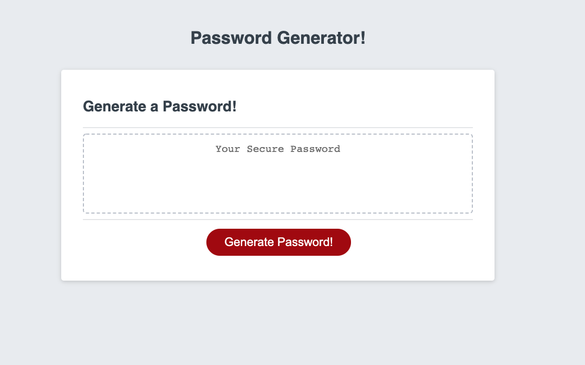
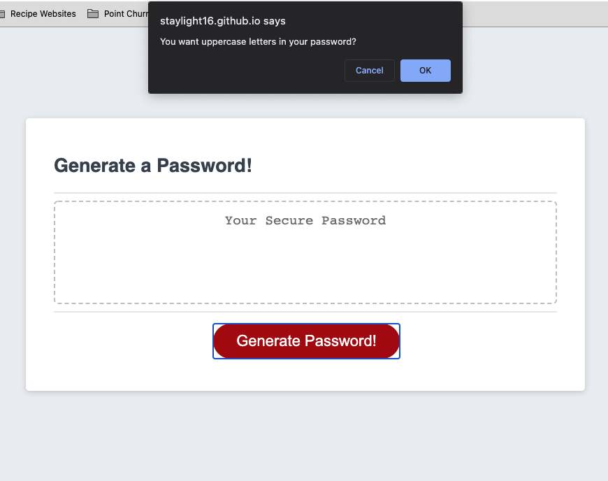
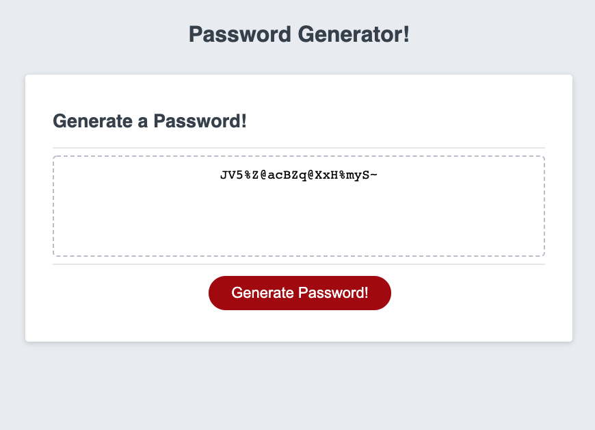

# PasswordGenerator


Password Generator we were assigned to build had to meet the following criteria: 


```
GIVEN I need a new, secure password
WHEN I click the button to generate a password
THEN I am presented with a series of prompts for password criteria
WHEN prompted for password criteria
THEN I select which criteria to include in the password
WHEN prompted for the length of the password
THEN I choose a length of at least 8 characters and no more than 128 characters
WHEN prompted for character types to include in the password
THEN I choose lowercase, uppercase, numeric, and/or special characters
WHEN I answer each prompt
THEN my input should be validated and at least one character type should be selected
WHEN all prompts are answered
THEN a password is generated that matches the selected criteria
WHEN the password is generated
THEN the password is either displayed in an alert or written to the page
```
# Technologies Used: 
* HTML
* CSS
* Javascript


# Project Explanation: 
Application uses pop-up confirm boxes to identify user's password criteria. The application then generates a random password based on user's criteria. 

# Screenshots





In order to meet criteria, I had to complete various tasks within Javascript. I think things turned out fairly okay. This will serve as a useful exercise to sharpen my javascript coding skills. 

# Live Link of Deployed App
Deployed Version:  https://staylight16.github.io/PasswordGenerator/ 
